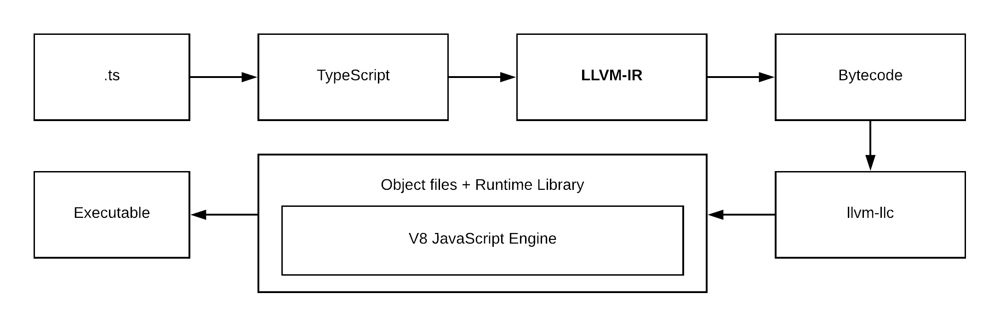

StaticScript
============

> Real Static Typed Script - RSTS project.

StaticScript is a language on top of TypeScript as frontend and LLVM as backend for code-generation to binary. 



# Installing

For latest stable version:

```sh
npm install -g static-script
```

# Let's write simple example

Put it in `calculate-pi.ts`

```ts
{
    function calculatePI(cycles: number): number {
        let inside = 0;

        for (let i = 0; i < cycles; i++) {
            let x = Math.random() * 2 - 1;
            let y = Math.random() * 2 - 1;

            if ((x*x + y*y) < 1) {
                inside++
            }
        }

        return 4.0 * inside / cycles;
    }

    console_log(calculatePI(100000));
}
```

Next compile it:

```sh
$ ./bin/ssc calculate-pi.ts
```

Next run it:

```sh
$ time ./output/main
```

This will produce:

```
3.144800
./output/main  0,01s user 0,00s system 80% cpu 0,013 total
```

### LICENSE

This project is open-sourced software licensed under the MIT License.

See the [LICENSE](LICENSE) file for more information.
